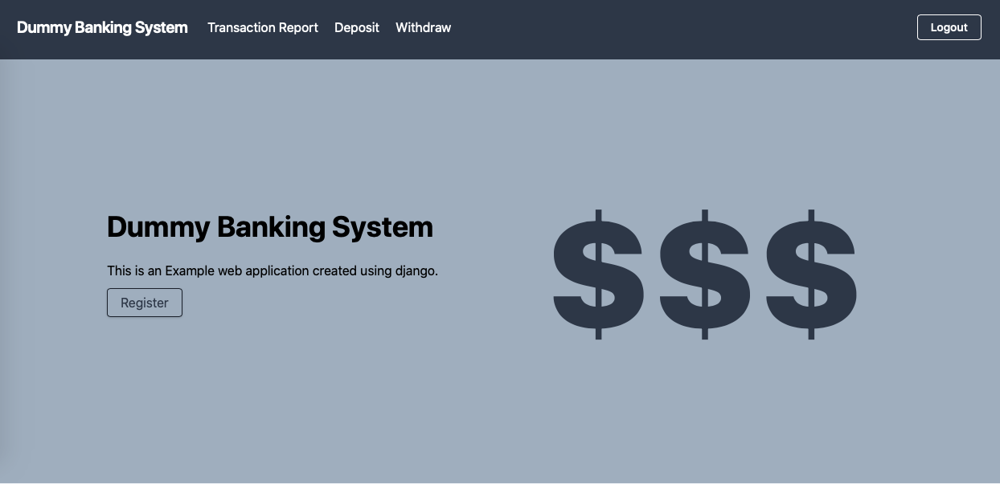
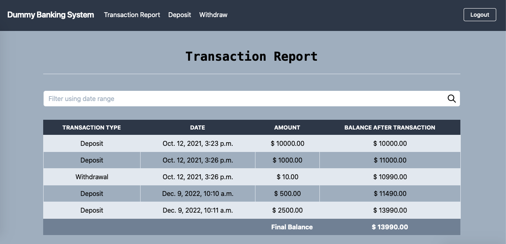
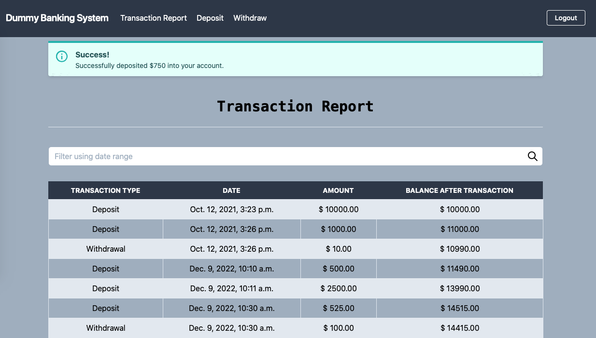
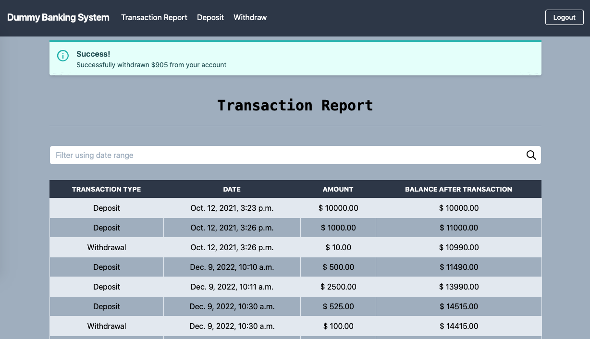

# Online Banking Concept created using Django Web Framework


## Features

* Create Bank Account
* Deposit & Withdraw Money
* Bank Account Type Support (e.g. Current Account, Savings Account)
* Interest calculation depending on the Bank Account type
* Transaction report with a date range filter 
* See balance after every transaction in the Transaction Report
* Calculate Monthly Interest Using Celery Scheduled tasks
* More efficient and accurate interest calculation and balance update
* Ability to add Minimum and Maximum Transaction amount restriction
* Modern UI with Tailwind CSS


## Prerequisites

Be sure you have the following installed on your development machine:

+ Python >= 3.7
+ Git
+ pip
+ Virtualenv

## Requirements

+ celery==4.4.7
+ Django==3.2
+ django-celery-beat==2.0.0
+ python-dateutil==2.8.1
+ redis==3.5.3


## Project Installation
To setup a local development environment:

Create a virtual environment in which to install Python pip packages. With [virtualenv](https://pypi.python.org/pypi/virtualenv),
```bash
virtualenv venv            # create a virtualenv
source venv/bin/activate   # activate the Python virtualenv 
```


Install development dependencies
```bash
pip install -r requirements.txt
```

Migrate Database
```bash
python3 manage.py makemigrations # Makes migration files to track model changes
python3 manage.py migrate # Runs those migration files in the database
```

Run the web application locally
```bash
python manage.py runserver # 127.0.0.1:8000
```


Run Celery
```bash
pip install celery
pip install django-celery-beat 

```
Django Installation Steps :-
Install Python 3.7 Or Higher
Install Django version 2.2.0
Install all dependencies cmd -python -m pip install –-user -r requirements.txt
Finally run cmd - python manage.py runserver


Superuser Password
```bash
admin email -> admin@admin.com

admin password -> admin123
```




